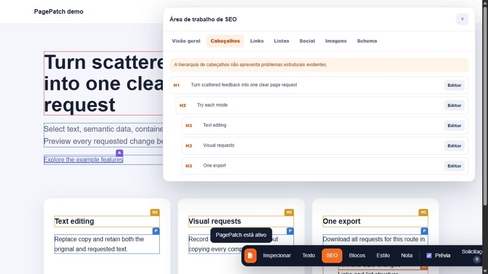

# PagePatch

Point at a webpage, say what should change, and export one clear request.

[Try PagePatch](https://pagepatch.evoltex.com.br/) · [Open the demo](https://pagepatch.evoltex.com.br/demo/index.html?edit-mode)



PagePatch is a visual change-request editor that runs on top of an existing webpage. A teammate can edit copy, review SEO, propose CSS, attach notes, and preview everything in place. PagePatch saves the requests in the browser and exports one Markdown file for the person implementing the work.

It ships as one JavaScript file and has no runtime dependencies, account system, or backend.

## Start in two minutes

1. Open the [PagePatch installer](https://pagepatch.evoltex.com.br/).
2. Drag **PagePatch by Evoltex** to your bookmarks bar.
3. Open the webpage you want to review and click the bookmark.
4. Choose a mode, click an element, and write the request.
5. Check the preview and export the page.

The installer also lets you copy the bookmark code when dragging is inconvenient.

## What it handles

- Text edits with the original and requested copy.
- Semantic changes between `H1` through `H6`, `P`, and `SPAN`.
- Page title, description, canonical URL, robots, and referrer settings.
- Heading hierarchy, links, lists, social cards, images, and JSON-LD.
- Computed CSS inspection with selected overrides.
- Notes for layout, behavior, assets, or work that cannot be previewed directly.
- One route-wide export with readable instructions and lossless JSON import data.
- Local preview persistence across reloads and React-style DOM rerenders.

Every visible item in the SEO workspace and request list can locate and flash its element on the page.

## Other ways to load it

Add the hosted script to a page you control:

```html
<script src="https://pagepatch.evoltex.com.br/pagepatch.js"></script>
```

The script stays dormant until the URL contains `edit-mode`:

```text
https://example.com/pricing?edit-mode
```

You can also start it yourself:

```js
window.PagePatch.start()
```

## Importing a request

Drop an exported `.md` or `.json` file on the [PagePatch homepage](https://pagepatch.evoltex.com.br/). It shows the target page and active request count before opening an import link. Click the bookmark on that page to load and preview the requests.

## Privacy and limitations

- PagePatch stores requests in `localStorage` for the current browser and website origin.
- It does not send requests to PagePatch, Evoltex, or the website being reviewed.
- Preview changes affect only the current browser DOM. They do not change the real website or its source code.
- Content Security Policy rules can prevent bookmarklets or externally hosted scripts on some websites.
- Clearing browser storage removes requests that have not been exported.

Only load the script from a host you trust. Like any browser inspector, PagePatch can read the DOM of the page where it runs.

## Development

PagePatch requires Node.js 20 or newer for its development tools.

```bash
npm ci
npm test
npm run check
npm run build
```

The build writes the standalone script to `dist/pagepatch.js` and prepares the Cloudflare Pages files in `deploy/`.

```text
src/pagepatch.js          Source
dist/pagepatch.js         Standalone distribution
demo/                     Local demo page
deploy/                   Hosted installer, demo, and script
test/                     Node and browser-DOM regression tests
PRODUCT-BRIEF.md          Product intent and boundaries
```

## Public API

```js
window.PagePatch.start()
window.PagePatch.stop()
window.PagePatch.getChanges()
window.PagePatch.exportPage()
window.PagePatch.clearPage()
```

## Contributing

Bug reports and focused pull requests are welcome. Read [CONTRIBUTING.md](CONTRIBUTING.md) before making a change.

## License

[MIT](LICENSE) © Felipe Guimarães
